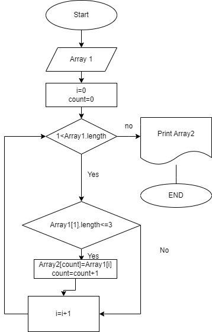

## КОНТРОЛЬНАЯ РАБОТА

# Описание решения

Изначально пользователь вводит количество строк в массиве, затема вводит сами строки. Заполняем массив (Array1) этими строками. Создаем второй массив (Array2) такой же длинной, как и изначальный. После создания нового массива используем метод, в котором проверяем длину каждой строки(<=3). И заполняем новый массив.

# Блок схема

Блок схема изображена на схеме:

